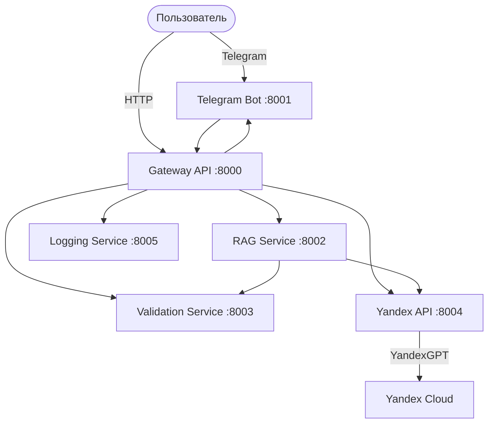

# Архитектура ИИ Бармена




## Микросервисы

| Сервис | Порт | Описание |
|:---|:---:|:---|
| Gateway API | 8000 | Единая точка входа |
| Telegram Bot | 8001 | Обработка сообщений |
| RAG Service | 8002 | Векторный поиск |
| Validation | 8003 | Модерация |
| Yandex API | 8004 | YandexGPT |
| Logging | 8005 | Логирование |

---

**Готовы начать?** Переходите к [Быстрому старту](quickstart.md)!
```
